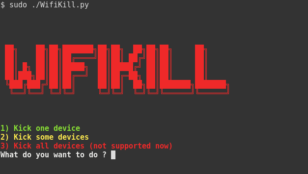

# WifiKill
Tool to disconnect people from internet in LAN or WLAN

## Version 
1.1.0

## Installation

```bash
git clone https://github.com/Xinruk/WifiKill.git
pip install -r requirements.txt
 ```
## Screenshot



## ToDo
add support for Windows, MacOS and Android

add attackmode 3 : Kick all devices


#### changelog
On version 1.1.0:
- Works on linux 
- Support only /24 networks
